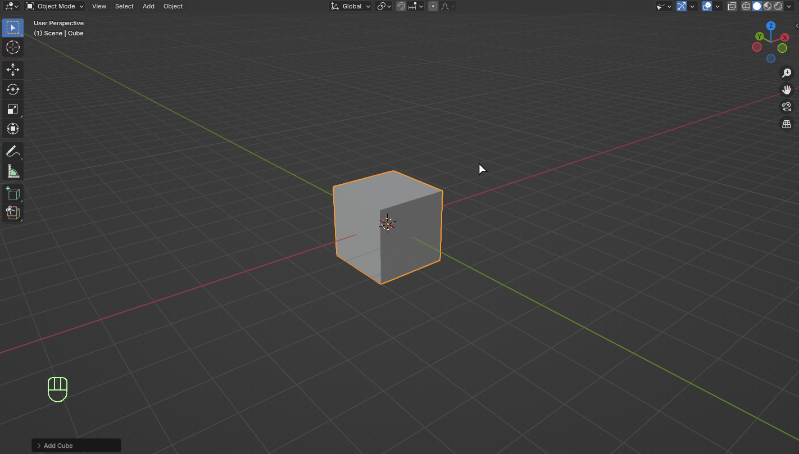
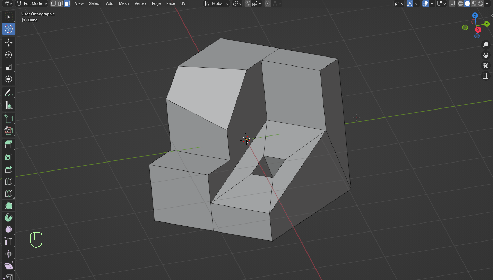
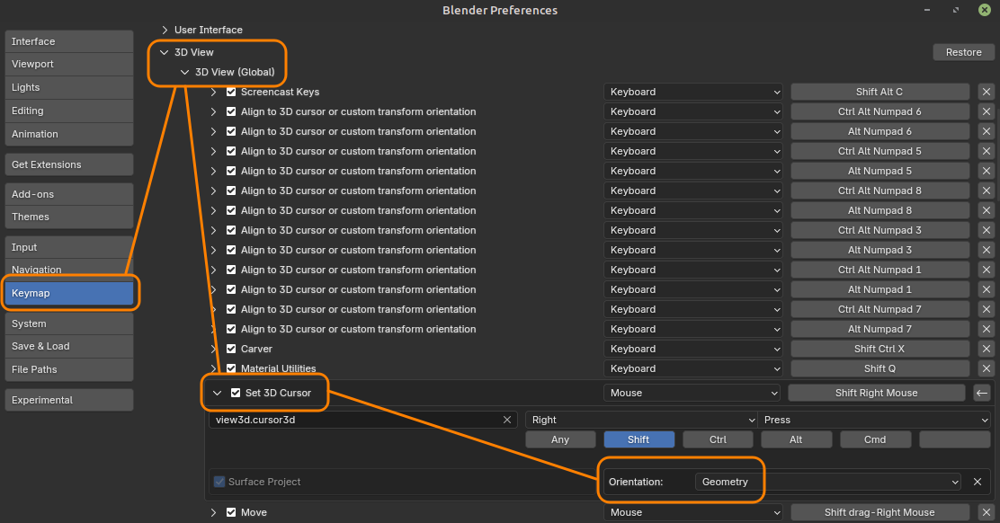

# Align2Custom

Blender incorporates 3 operators to align the 3D view :
 - alignment to the global transform orientation
 - alignment to a local transform orientation
 - alignment to the camera orientation

This add-on offers 2 custom alignment features for the 3D view :
 - alignment to the 3D cursor orientation
 - alignment to a custom transform orientation

 

## Features

### Alignment to the 3D cursor orientation

First, you need to change the 3D cursor orientation by using the method of your choice.

Next, use one of the following keyboard shortcuts to align the 3D View to the 3D cursor orientation :
 - Top View    : <kbd>ALT</kbd> + <kbd>NUMPAD 8</kbd>
 - Bottom View : <kbd>ALT</kbd> + <kbd>CTRL</kbd> + <kbd>NUMPAD 8</kbd>
 - Front View  : <kbd>ALT</kbd> + <kbd>NUMPAD 5</kbd>
 - Back View   : <kbd>ALT</kbd> + <kbd>CTRL</kbd> + <kbd>NUMPAD 5</kbd>
 - Right View  : <kbd>ALT</kbd> + <kbd>NUMPAD 6</kbd>
 - Left View   : <kbd>ALT</kbd> + <kbd>CTRL</kbd> + <kbd>NUMPAD 6</kbd>

 

 

Those commands are also accessible in the `View` -> `Align View` -> `Align View to Cursor` top menu of the 3D View.

 

	
 

3D cursor can be used to align the 3D view to an object's face by calling the snapping tool of the cursor (<kbd>SHIFT</kbd> + <kbd>Right Mouse Button</kbd> click on the face) :

 

 

__Note__ : the snapping tool of the 3D cursor does not align the cursor orientation to the face one by default. You need to configure the tool in the `Keymap` section of the `Preferences` panel as follows, and to save your modification to make it permanent :

 

 

### Alignment to a custom transform orientation

This method is based on the Blender feature that allows to define custom transform orientations.

To align the 3D View to a _custom transform orientation_, it must have been created beforehand, like in the following example (based on the normal axes of an object's face) :

 

 

Then, you can use one of the following keyboard shortcuts to align the 3D View to its axes :
 - Top View    : <kbd>ALT</kbd> + <kbd>NUMPAD 7</kbd>
 - Bottom View : <kbd>ALT</kbd> + <kbd>CTRL</kbd> + <kbd>NUMPAD 7</kbd>
 - Front View  : <kbd>ALT</kbd> + <kbd>NUMPAD 1</kbd>
 - Back View   : <kbd>ALT</kbd> + <kbd>CTRL</kbd> + <kbd>NUMPAD 1</kbd>
 - Right View  : <kbd>ALT</kbd> + <kbd>NUMPAD 3</kbd>
 - Left View   : <kbd>ALT</kbd> + <kbd>CTRL</kbd> + <kbd>NUMPAD 3</kbd>

__Note__ : these commands have no effect if no _Custom_ transform orientation is active.

 

 

Those commands are also accessible in the `View` -> `Align View` -> `Align View to Custom` top menu of the 3D View.

 

 

## Installation

This addon can be installed in two differents ways.

### Installation from Github

This method is recommended for Blender versions prior to 4.2 :
 - Download ZIP file of [Align2Custom V2.1.2](https://github.com/fdaubine/Align2Custom/releases/tag/V2.1.2) from the release section
 - Open Blender, then drag and drop the ZIP file onto Blender UI to install the add-on
 - Check that the `Align 2 Custom` option appears in the list of add-ons (`Edit` -> `Preferences...` -> `Add-ons`)

### Installation from Blender Extensions platform

Since 4.2 version, Blender can connect to an online platform called __Blender Extensions__ to download and install tons of add-ons. This add-on is now available on this platform. To install it, follow these instructions :
- Look for __Align2Custom__ add-on on [Blender Extensions](https://extensions.blender.org/)
- Follow the [installation instructions](https://extensions.blender.org/about/)
- In Blender, check that the `Align 2 Custom` option appears in the list of add-ons (`Edit` -> `Preferences...` -> `Add-ons`)

This method is recommended for Blender 4.2 (and newer) because add-on update can be managed easily and directly from Blender UI whenever a new version of the add-on is published.

### add-on preferences

If you prefer hard transitions or if you're facing problems (odd behaviors, performance, ...), the add-on installation panel provides an option to disable the smooth transition during the 3D View alignment.

 

 

## Changelog

### V2.1.2

License change from GNU GPL V2 to V3 to fulfill __Blender Extensions__ platform requirements

### V2.1.1

Removal of useless "Adjust last operation" panel

### V2.1.0

Packaging optimization for publication on __Blender Extensions__ platform.
No functional evolution nor bug fixing.
No need to update to this version if you run a Blender version prior to __4.2__.

### V2.0.1

Bug correction (Issue #3) for Blender 4.0 compatibility.

### V2.0.0

New feature : align the 3D view to the 3D cursor orientation.
Improvement : smooth alignment transitions.

### V1.0.0

First stable release.
Only feature : align the 3D view to a custom orientation.

